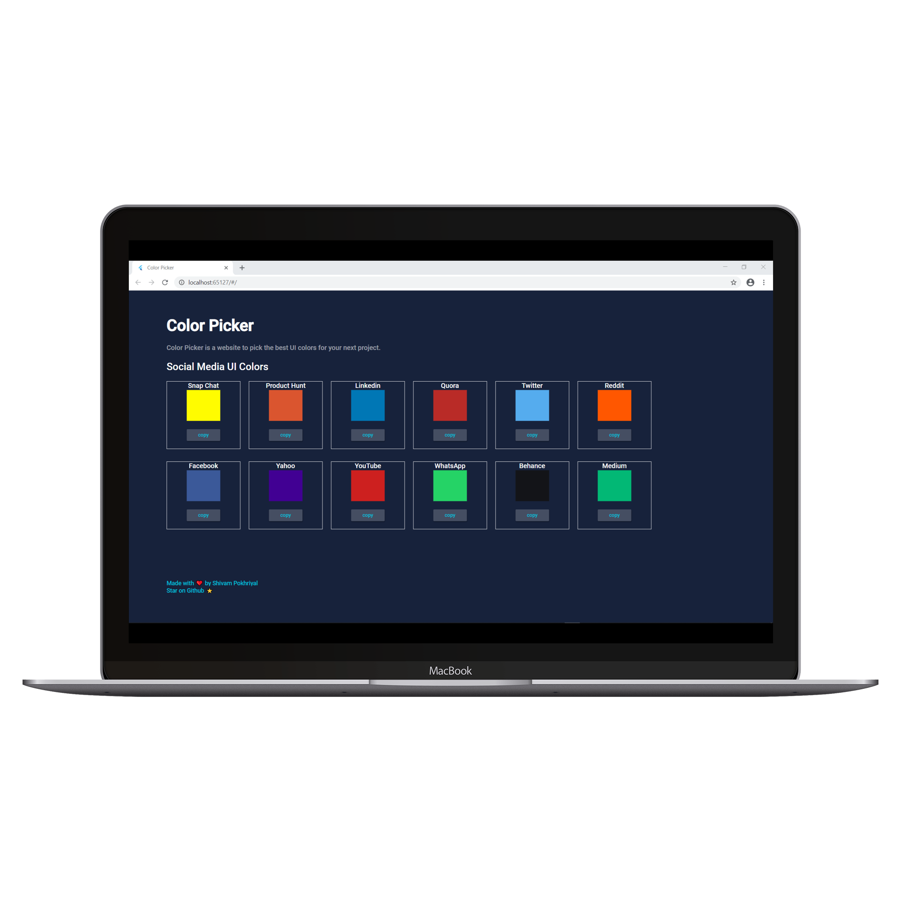
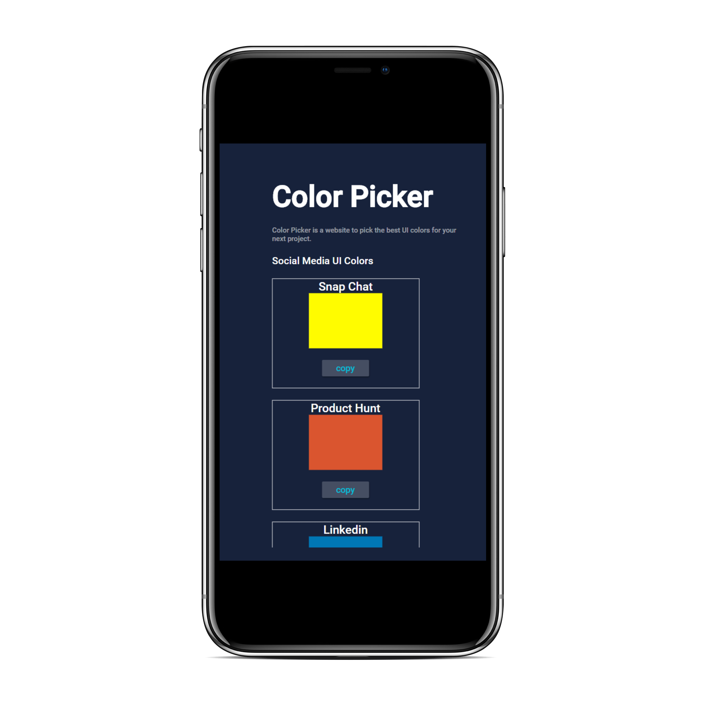

# Color Picker

A new Flutter project.

## Getting Started

git clone https://github.com/fs0sp/Social-Media-Color-Palette.git

### Dependencies

<ul>
    <li>cupertino_icons: ^1.0.0 </li>
    <li>clipboard: ^0.1.2+8 </li>
    <li>responsive_builder: ^0.3.0 </li>
    <li>responsive_widgets: ^2.0.1 </li>
</ul>

### Screenshots :fire:

  

#### ~ Shivam Pokhriyal